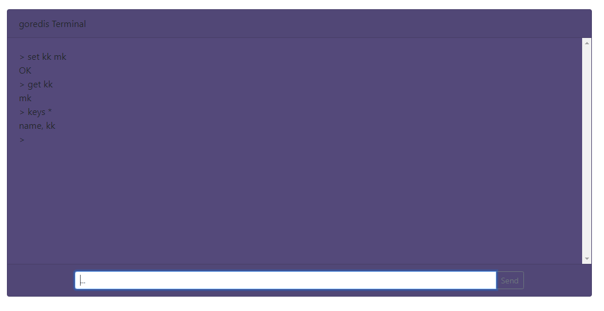

# goredis 

使用 go 做 redis 的简易实现（仅实现部分命令），用于学习 Go 语言。
玩具系列之二。

## 功能

可客户端连接，可 Web 端直接使用

先只支持字符串存储，把框架搭起来，后期再增加支持的数据结构。

## todo

- [x] web 端访问
- [ ] 增加数据结构支持
- [ ] 支持编程语言客户端连接

参考《Redis 设计与实现》 中客户端与服务器部分设计。

## How to

### 1. 运行 goredis 服务器

```sh
> go run ./goredis/app.go
2020/02/20 12:57:06 goredis is starting
2020/02/20 12:57:06 goredis server listening on 127.0.0.1:8064 ....
```

### 2. 运行客户端

```sh
> go run ./goredis/client/client.go
127.0.0.1:8064> keys
(error) ERR wrong number of arguments
127.0.0.1:8064> get name
nil
127.0.0.1:8064> set name golang
OK
127.0.0.1:8064> get name
golang
127.0.0.1:8064> keys *
name
127.0.0.1:8064>  
```
exit 退出客户端

### 3. Web 页面访问

```sh
> cd ./goredis/httpserver
> go run ./httpServer.go
httpserver listening on 127.0.0.1:9090 ....
```


<kbd>Enter</kbd> 直接发送命令，<kbd>Up</kbd> & <kbd>Down</kbd> 快速调出历史命令。

## 命令

- [x] SET
- [x] GET
- [x] KEYS
- [ ] SETNX & distributed lock